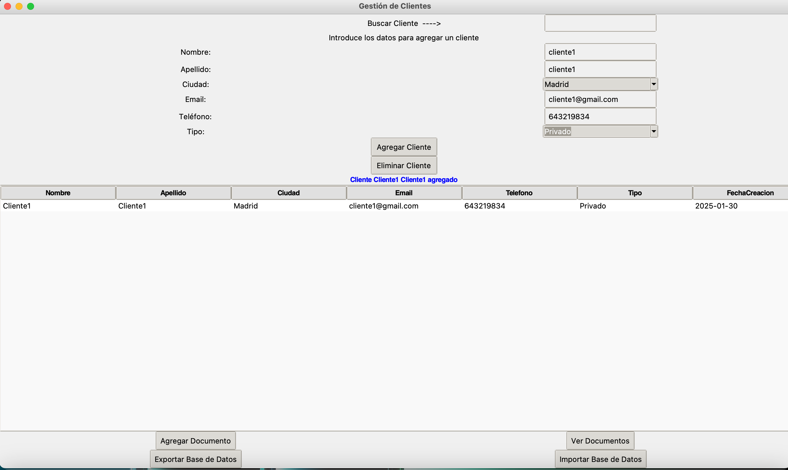

# gestor_clientes
Esta aplicación desarrollada en python utilizando la librería tkinter implementa un simple gestor de clientes, para que los usuarios puedan simplificar su gestión y búsqueda de clientes y documentos asociados a ellos. Esta aplicación está enfocada a abogados. 

La aplicación crea en el escritorio una carpeta "Clientes", donde, automáticamente se irán creando carpetas para cada cliente y se irán guardando sus documentos correspondientes.

Así se ve la interfaz de usuario:

